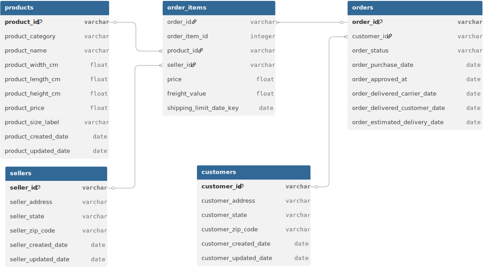
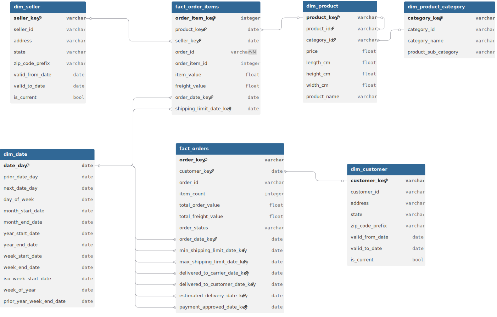
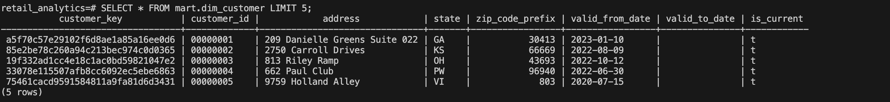

# Retail Analytics with DBT

This project demonstrates how to design and implement an analytics data warehouse for an e-commerce store using **dbt**. The focus is on building scalable data models, applying transformation logic, and leveraging dbt’s testing, lineage, and documentation capabilities.

The aim is to explore how dbt can serve as the core framework for analytics engineering, while addressing a consistent set of business questions. This provides a clear, hands-on view of dbt’s strengths in structuring data workflows and ensuring reliability.

Although the primary motivation is personal development, the work is fully documented to serve as a learning resource for others interested in analytics engineering with dbt.

This same dataset is used in the following projects:
- [Retail Analytics with Spark](https://github.com/hardeybisey/retail-analytics-with-spark)
- [Retail Analytics with Dataflow](https://github.com/hardeybisey/retail-analytics-with-dataflow)

---

## Technology Stack
* [Docker](https://docs.docker.com/engine/install/)
* [DBT](https://docs.getdbt.com/)
* [Postgres](https://www.postgresql.org/docs/)

---
## Data Context
The dataset is a synthetic e-commerce dataset simulating activities between 2020-01-01 and 2024-12-31. It captures the relationships between customers, sellers, orders, order items, and products.

The data is structured to support analytics on customer behaviour, product sales, fulfilment timelines, and seller performance.

### **Raw Data Schema**


---

### **Data Dictionary**


| Dataset Name              | Description                                                                                                                                                                                | Columns                                    |
|--------------------------|--------------------------------------------------------------------------------------------------------------------------------------------------------------------------------------------|---------------------------------------------------------------|
| **Customers**            | Contains customer information and location.                                            | `customer_id`, `customer_address`, `customer_zip_code`, `customer_state`, `customer_created_date`, `customer_updated_date` |
| **Sellers**              | Information about sellers, including their location. Used to trace product fulfilment.                                                                                         | `seller_id`, `seller_address`,`seller_zip_code`, `seller_state`, `seller_created_date`, `seller_updated_date` |
| **Orders**               | Core dataset representing individual purchases and delivery timelines.                                                                                                | `order_id`, `customer_id`, `order_status`, `order_purchase_date`, `order_approved_at`, `order_delivered_carrier_date`, `order_delivered_customer_date`, `order_estimated_delivery_date` |
| **Order Items**          | Data on each item within an order. Includes quantity, value, and freight for each item.                                                                                                    | `order_id`, `order_item_id`, `product_id`, `seller_id`, `shipping_limit_date`, `price`, `freight_value` |
| **Products**             | Information about products sold. Includes name, category, and physical attributes.                                                                                                         | `product_id`, `product_category`, `product_name`, `product_size_label`, `product_width_cm`, `product_length_cm`, `product_height_cm`, `product_price`, `product_created_date`, `product_updated_date`|
---

## Analytics Data Layers
* `staging`: Raw data with light transformation
* `mart`: Analytics ready tables
* `analyses`: View for business related questions
* `obt`: Pre-joined views for analytics queries.

---

## Analytics Data Model

---

### Dimension
| Table Name              | Grain                             | Description                                                              |
|------------------------|-----------------------------------|--------------------------------------------------------------------------|
| dim_customer           | 1 row per customer_sk      | Unique customer profile                           |         |
| dim_seller             | 1 row per seller_sk               | Seller metadata and location                                             |
| dim_product            | 1 row per product_sk              | Product metadata and physical attributes                                 |
| dim_date               | 1 row per day                     | Date dimension for temporal analysis                                     |

---

### Facts

| Table Name              | Grain                             | Description                                                              |
|------------------------|-----------------------------------|--------------------------------------------------------------------------|
| fact_orders_summary            | 1 row per order_key                 | Order lifecycle: purchase, delivery, status                              |
| fact_order_items       | 1 row per order_item_key(`order_id+item_id`)       | Item-level value, freight, product, seller                               |                          |

---
## Project Setup Instructions

### Set up your environment
```bash
# 1. clone the repo
git clone https://github.com/hardeybisey/retail-analytics-with-dbt.git

# 2. Change to the project directory
cd retail-analytics-with-dbt

# 3. Rename the environment file
mv example.env .env

# 4. Edit the .env file to include your Postgres credentials:
PG_USER=<your_postgres_username>
PG_PASSWORD=<your_postgres_password>

# 5. Start Services with Docker
docker compose up -d

# 6. Check that the container is up, you should look for a container named `dbt`
docker ps

# 7. Open a shell session into the dbt container
docker exec -it dbt bash
```

### Running the dbt model
Inside the dbt container, run the following commands in order:
```bash
# 1. Install dbt dependencies defined in `retail-analytics-with-dbt/retail_analytics/packages.yml`.
dbt deps

# 2. Load CSV files from into Postgres as seed data
dbt seed

# 3. `customers_dim` and `sellers_dim` and `product_dim` tables are managed as SCD Type 2 tables with dbt snpashot.
dbt snapshot

# 4. Run the core dbt models (transforms staging → marts)
dbt run

# 5. Execute tests (e.g., unique, not_null, relationships)
dbt test

# 6. Generate static documentation files
dbt docs generate

# 7. Serve the docs from the container and  visit http://localhost:8081 on the host to view the page.
dbt docs serve --host 0.0.0.0 --port 8080

# 8. The `analyses` directory contains SQL for business intelligence or ad-hoc exploration. These queries are not materialized by `dbt run`. Instead, dbt compiles them, and you can then copy the resulting SQL from the `target` directory to run it directly in the database.
```
---

### Preview Data and Schema Using DBeaver (NOTE: you can use any sql editor, simply login using the PG_USER and PG_PASS credentials in the `.env` file you created eariler.)


---

### DBT Lineage Diagram


---
### DBT Concepts Explored

- [**dbt seeds**](https://docs.getdbt.com/docs/build/seeds)
- [**dbt sources**](https://docs.getdbt.com/docs/build/sources)
- [**dbt tags**](https://docs.getdbt.com/reference/resource-configs/tags)
- [**dbt snapshots**](https://docs.getdbt.com/docs/build/snapshots)
- [**Model Contracts**](https://docs.getdbt.com/docs/mesh/govern/model-contracts)
- [**dbt macros**](https://docs.getdbt.com/docs/build/jinja-macros)
- [**dbt ref**](https://docs.getdbt.com/reference/dbt-jinja-functions/ref)
- [**dbt packages**](https://docs.getdbt.com/docs/build/packages)
- [**dbt analyses**](https://docs.getdbt.com/docs/build/analyses)

---

## Credits
This project was inspired by this [repo](https://github.com/cnstlungu/postcard-company-datamart)
