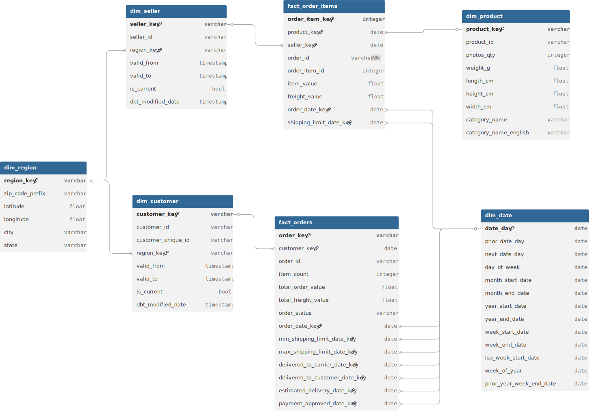
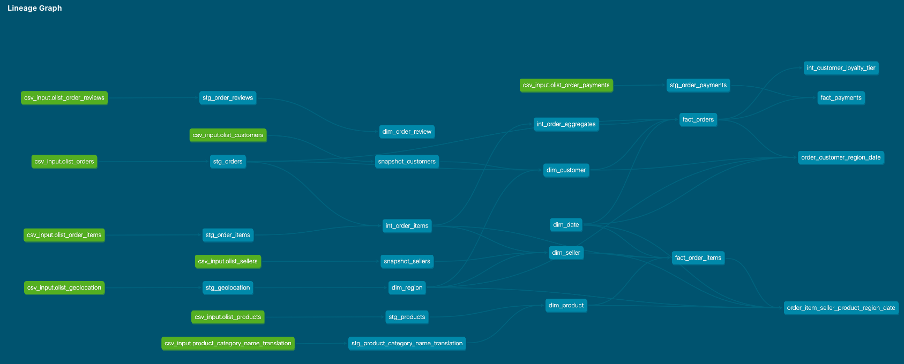

# Retail Analytics with DBT

The goal of this project is to design and implement an analytics data warehouse for an e-commerce store. The data model will be iteratively enhanced using a variety of tools, frameworks, and architectural patterns.

Given the fast-evolving nature of Analytics and Data Engineering, the ability to approach the same problem from multiple angles is a highly valuable skill. This project is structured around solving a consistent set of business questions using different technologies and methodologies — allowing for a comparative, hands-on exploration of modern data engineering practices.

While the primary motivation is personal development, all work will be documented to ensure the project is accessible and educational for others interested in learning or upskilling in this domain.

This same dataset is used in the following projects:
- [Retail Analytics with Spark](https://github.com/hardeybisey/retail-analytics-with-spark)
- [Retail Analytics with Dataflow](https://github.com/hardeybisey/retail-analytics-with-dataflow)
- [Retail Analytics with Airflow](https://github.com/hardeybisey/retail-analytics-with-airflow)
- [Retail Analytics with SQLMesh](https://github.com/hardeybisey/retail-analytics-with-sqlmesh)


## Project Technology Stack
* [Docker](https://docs.docker.com/engine/install/)
* [DBT](https://docs.getdbt.com/)
* [Postgres](https://www.postgresql.org/docs/)
* [Superset](https://superset.apache.org/docs/intro/)

---

**Link to full information and source of the dataset is [here](https://www.kaggle.com/datasets/olistbr/brazilian-ecommerce/data)**

---
## Data Context
The dataset contains real commercial data from Olist, the largest department store in Brazilian marketplaces. It includes information from nearly 100,000 orders placed between 2016 and 2018. The data is anonymized and covers various aspects of the e-commerce lifecycle.

### **Raw Data Schema**


---

### **Data Dictionary**


| Dataset Name              | Description                                                                                                                                                                                | Key Columns                                    |
|--------------------------|--------------------------------------------------------------------------------------------------------------------------------------------------------------------------------------------|---------------------------------------------------------------|
| **Customers**            | Contains customer information and location. Use `customer_id` to identify unique orders and `customer_unique_id` to identify repeat purchasers.                                            | `customer_id`, `customer_unique_id`, `customer_zip_code_prefix`, `customer_city`, `customer_state` |
| **Geolocation**          | Brazilian zip codes with latitude and longitude. Useful for mapping and distance calculations between customer and seller locations.                                                       | `geolocation_zip_code_prefix`, `geolocation_lat`, `geolocation_lng`, `geolocation_city`, `geolocation_state` |
| **Order Items**          | Data on each item within an order. Includes quantity, value, and freight for each item.                                                                                                    | `order_id`, `order_item_id`, `product_id`, `seller_id`, `shipping_limit_date`, `price`, `freight_value` |
| **Payments**             | Details payment methods used per order. Orders can have multiple payments using different methods.                                                                                         | `order_id`, `payment_sequential`, `payment_type`, `payment_installments`, `payment_value` |
| **Reviews**        | Customer reviews post-delivery or after the expected delivery date. Includes ratings and textual feedback.                                                                                 | `review_id`, `order_id`, `review_score`, `review_comment_title`, `review_comment_message`, `review_creation_date`, `review_answer_timestamp` |
| **Orders**               | Core dataset linking to all others. Represents individual purchases and delivery timelines.                                                                                                | `order_id`, `customer_id`, `order_status`, `order_purchase_timestamp`, `order_approved_at`, `order_delivered_carrier_date`, `order_delivered_customer_date`, `order_estimated_delivery_date` |
| **Products**             | Information about products sold. Includes name, category, and physical attributes.                                                                                                         | `product_id`, `product_category_name`, `product_name_lenght`, `product_description_lenght`, `product_photos_qty`, `product_weight_g`, `product_length_cm`, `product_height_cm`, `product_width_cm` |
| **Sellers**              | Data about sellers, including their location and identification. Used to trace product fulfilment.                                                                                         | `seller_id`, `seller_zip_code_prefix`, `seller_city`, `seller_state` |
| **Category Translation** | Translates original product categories (in Portuguese) to English.                                                                                                                          | `product_category_name`, `product_category_name_english` |

---

## Analytics Data Layers
* `staging`: Raw Data with light transformation
* `intermediate`: Shared Data Between Model
* `mart`:Analytics Ready Data
* `reports`: Views with prepagrregated joins on mart layer.

---

## Analytics Data Model

---

### Dimension
| Table Name              | Type      | Grain                             | Description                                                              |
|------------------------|-----------|-----------------------------------|--------------------------------------------------------------------------|
| dim_customer           | Dimension | 1 row per customer_key      | Unique customer profile, independent of orders                           |
| dim_region        | Dimension | 1 row per zip code prefix         | Geographic mapping of zip codes to lat/lon, city, state                  |
| dim_seller             | Dimension | 1 row per seller_key               | Seller metadata and location                                             |
| dim_product            | Dimension | 1 row per product_key              | Product metadata and physical attributes                                 |
| dim_product_category   | Dimension | 1 row per category name           | English translation of product categories                                |
| dim_date               | Dimension | 1 row per day                     | Date dimension for temporal analysis                                     |
| dim_order_review       | Dimension | 1 row per review_id               | Star rating, comments, review timeline                                   |

---

### Facts

| Table Name              | Type      | Grain                             | Description                                                              |
|------------------------|-----------|-----------------------------------|--------------------------------------------------------------------------|
| fact_orders            | Fact | 1 row per order_key                 | Order lifecycle: purchase, delivery, status                              |
| fact_order_items       | Fact | 1 row per order_item_key(`order_id+item_id`)       | Item-level value, freight, product, seller                               |
| fact_payments          | Fact | 1 row per payment_key(`order+payment_seq`)     | Multi-method or multi-installment payment data                           |

---
## Project Setup Instructions

### Set up your environment
```bash
# 1. Rename the environment file
mv example.env .env

# 2. Edit the .env file to include your Postgres credentials:
DB_USER=<your_postgres_username>
DB_PASSWORD=<your_postgres_password>

# 3. Start Services with Docker
docker compose up -d

# 4. Check that the container is up, you should look for a container named `dbt-container`
docker ps

# 5. Open a shell session into the dbt container
docker exec -it dbt-container bash

# 6. Unzip the `data.zip` file in the root of the repo and copy it's content into the dbt project seeds `retail-analytics-with-dbt/retail_analytics/seeds` folder
```

### Running the dbt model
Inside the dbt container, run the following commands in order:
```bash
# 1. Install dbt dependencies (e.g., packages from packages.yml)
dbt deps

# 2. Load CSV files from into Postgres as seed data
dbt seed

# 3. Apply snapshot logic (for SCD Type 2 tables like `customers` and `sellers`)
dbt snapshot

# 4. Run the core dbt models (transforms staging → marts)
dbt run

# 5. Execute tests (e.g., unique, not_null, relationships)
dbt test

# 6. Generate static documentation files
dbt docs generate

# 7. Serve the docs via a local web server (visit http://localhost:8080)
dbt docs serve
```
---

### DBT Lineage Diagram

---

## Credits
This project was inspired by this [repo](https://github.com/cnstlungu/postcard-company-datamart)
