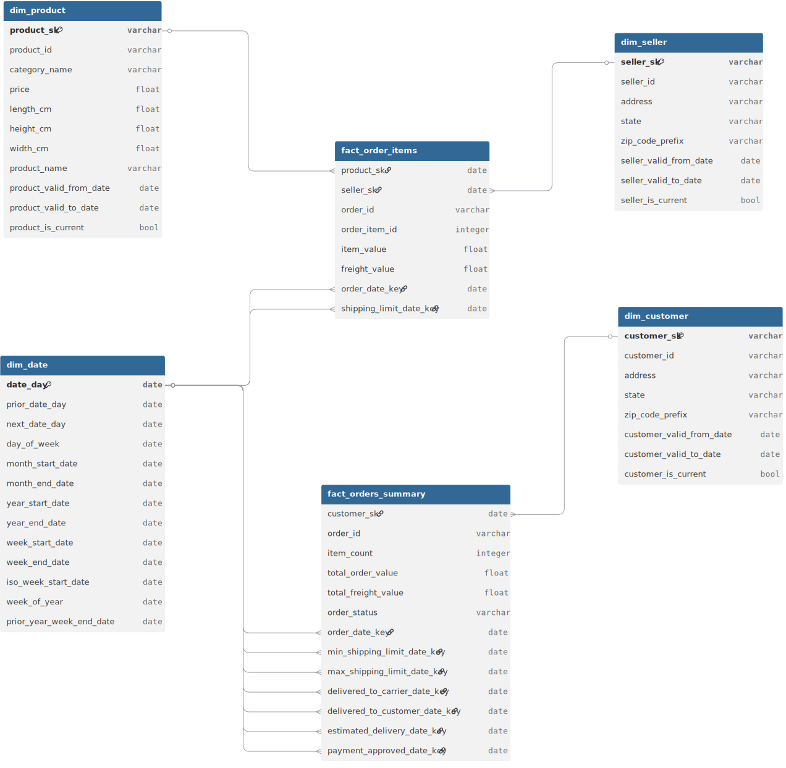
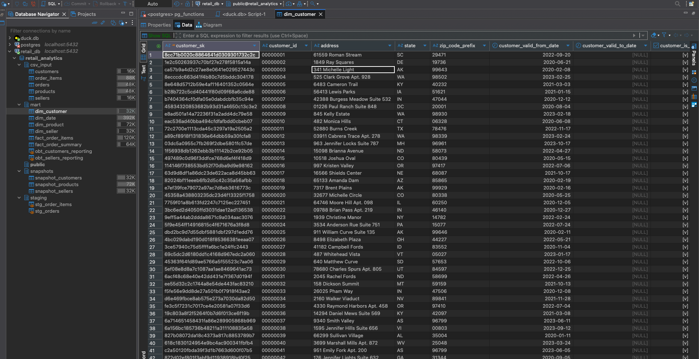

# Retail Analytics with DBT

This project demonstrates how to design and implement an analytics data warehouse for an e-commerce store using **dbt**. The focus is on building scalable data models, applying transformation logic, and leveraging dbt’s testing, lineage, and documentation capabilities.

The aim is to explore how dbt can serve as the core framework for analytics engineering, while addressing a consistent set of business questions. This provides a clear, hands-on view of dbt’s strengths in structuring data workflows and ensuring reliability.

Although the primary motivation is personal development, the work is fully documented to serve as a learning resource for others interested in analytics engineering with dbt.

This same dataset is used in the following projects:
- [Retail Analytics with Spark](https://github.com/hardeybisey/retail-analytics-with-spark)
- [Retail Analytics with Dataflow](https://github.com/hardeybisey/retail-analytics-with-dataflow)
- [Retail Analytics with Airflow](https://github.com/hardeybisey/retail-analytics-with-airflow)
- [Retail Analytics with SQLMesh](https://github.com/hardeybisey/retail-analytics-with-sqlmesh)

---

## Project Technology Stack
* [Docker](https://docs.docker.com/engine/install/)
* [DBT](https://docs.getdbt.com/)
* [Postgres](https://www.postgresql.org/docs/)

---
## Data Context
The dataset is a synthetic e-commerce dataset simulating activities between 2020-01-01 and 2024-12-31. It captures the relationships between customers, sellers, orders, order items, and products.

The data is structured to support analytics on customer behaviour, product sales, fulfilment timelines, and seller performance.

### **Raw Data Schema**


---

### **Data Dictionary**


| Dataset Name              | Description                                                                                                                                                                                | Columns                                    |
|--------------------------|--------------------------------------------------------------------------------------------------------------------------------------------------------------------------------------------|---------------------------------------------------------------|
| **Customers**            | Contains customer information and location.                                            | `customer_id`, `customer_address`, `customer_zip_code`, `customer_state`, `customer_created_date`, `customer_updated_date` |
| **Sellers**              | Data about sellers, including their location and identification. Used to trace product fulfilment.                                                                                         | `seller_id`, `seller_address`,`seller_zip_code`, `seller_state`, `seller_created_date`, `seller_updated_date` |
| **Orders**               | Core dataset linking to all others. Represents individual purchases and delivery timelines.                                                                                                | `order_id`, `customer_id`, `order_status`, `order_purchase_date`, `order_approved_at`, `order_delivered_carrier_date`, `order_delivered_customer_date`, `order_estimated_delivery_date` |
| **Order Items**          | Data on each item within an order. Includes quantity, value, and freight for each item.                                                                                                    | `order_id`, `order_item_id`, `product_id`, `seller_id`, `shipping_limit_date`, `price`, `freight_value` |
| **Products**             | Information about products sold. Includes name, category, and physical attributes.                                                                                                         | `product_id`, `product_category`, `product_category_id`, `product_name`, `product_size_label`, `product_width_cm`, `product_length_cm`, `product_height_cm`, `product_price`|
---

## Analytics Data Layers
* `staging`: Raw data with light transformation
* `mart`: Analytics ready tables
* `analyses`: View for business related questions
* `obt`: Pre-joined views for analytics queries.

---

## Analytics Data Model

---

### Dimension
| Table Name              | Grain                             | Description                                                              |
|------------------------|-----------------------------------|--------------------------------------------------------------------------|
| dim_customer           | 1 row per customer_key      | Unique customer profile, independent of orders                           |         |
| dim_seller             | 1 row per seller_key               | Seller metadata and location                                             |
| dim_product            | 1 row per product_key              | Product metadata and physical attributes                                 |
| dim_product_category   | 1 row per category_key           | Product categories                                |
| dim_date               | 1 row per day                     | Date dimension for temporal analysis                                     |

---

### Facts

| Table Name              | Grain                             | Description                                                              |
|------------------------|-----------------------------------|--------------------------------------------------------------------------|
| fact_orders            | 1 row per order_key                 | Order lifecycle: purchase, delivery, status                              |
| fact_order_items       | 1 row per order_item_key(`order_id+item_id`)       | Item-level value, freight, product, seller                               |                          |

---
## Project Setup Instructions

### Set up your environment
```bash
# 1. clone the repo
git clone https://github.com/hardeybisey/retail-analytics-with-dbt.git

# 2. Change to the project directory
cd retail-analytics-with-dbt

# 3. Rename the environment file
mv example.env .env

# 4. Edit the .env file to include your Postgres credentials:
PG_USER=<your_postgres_username>
PG_PASSWORD=<your_postgres_password>

# 5. Start Services with Docker
docker compose up -d

# 6. Check that the container is up, you should look for a container named `dbt`
docker ps

# 7. Open a shell session into the dbt container
docker exec -it dbt bash
```

### Running the dbt model
Inside the dbt container, run the following commands in order:
```bash
# 1. Install dbt dependencies (e.g., packages from packages.yml)
dbt deps

# 2. Load CSV files from into Postgres as seed data
dbt seed

# 3. `customers_dim` and `sellers_dim` tables are managed as SCD Type 2 tables with dbt snpashot.
dbt snapshot

# 4. Run the core dbt models (transforms staging → marts)
dbt run

# 5. Execute tests (e.g., unique, not_null, relationships)
dbt test

# 6. Generate static documentation files
dbt docs generate

# 7. Serve the docs from the container and  visit http://localhost:8081 on the host to view the page.
dbt docs serve --host 0.0.0.0 --port 8080

# 8. The `analyses` directory contains SQL for business intelligence or ad-hoc exploration. These queries are not materialized by `dbt run`. Instead, dbt compiles them, and you can then copy the resulting SQL from the `target` directory to run it directly in your database.
```
---

### Preview Data In postgres
```bash
# 1. Open a shell session into the postgres container
docker exec -it  postgres-db bash

# 2. Connect to the Database with psql
psql -U $POSTGRES_USER -d retail_analytics

# 3. Explore the Database
\dn #list all schemas
\dt mart.* #list all tables in marts schema

# 4. Preview the first 5 rows of dim_customer table.
SELECT * FROM mart.dim_customer LIMIT 5;
```



### DBT Lineage Diagram


---
### DBT Concepts Explored

*   **dbt seeds**: This feature allows you to load static data from CSV files directly into your data warehouse.

*   **dbt source**: In dbt, a source is a way to name and describe the raw data that you load into your data warehouse. By defining sources, you can reference them in your models, test the quality of your raw data.

*   **dbt ref**: The `ref` function is fundamental to building modular and dependent data models in dbt. It allows you to reference another model within your dbt project, creating a dependency between them.

*   **dbt tags**: Tags are metadata labels that you can apply to your dbt resources, such as models, seeds, and snapshots. They help you organize and categorize your project, allowing you to selectively run or test specific parts of your project.

*   **dbt snapshots**: Snapshots are a powerful feature for capturing and tracking changes to your data over time. They are particularly useful for managing slowly changing dimensions (SCDs), where you need to maintain a historical record of how data has changed.

*   **dbt macros**: Macros in dbt are reusable pieces of SQL code, similar to functions in traditional programming languages. They are defined using the Jinja templating language and allow you to write DRY (Don't Repeat Yourself) code.

*   **dbt packages**: In dbt, packages are standalone dbt projects that contain reusable models, macros, and tests. They are conceptually similar to libraries in programming languages, allowing you to import code from other projects into your own.

*   **dbt analyses**: Analyses in dbt are SQL queries that are used for exploration and ad-hoc analysis. Unlike models, they are not materialized as tables or views in your data warehouse.
---

## Credits
This project was inspired by this [repo](https://github.com/cnstlungu/postcard-company-datamart)
